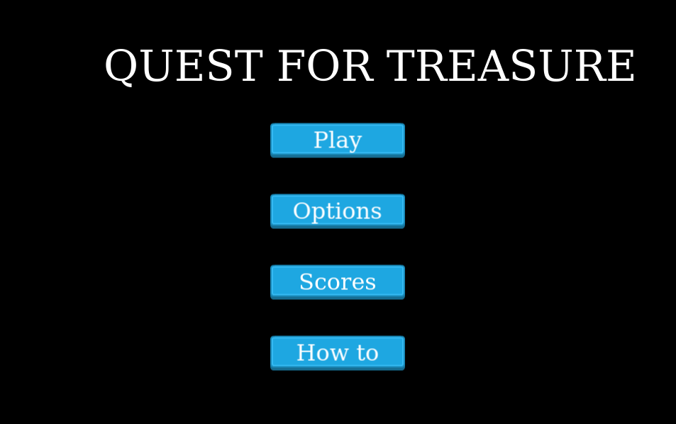
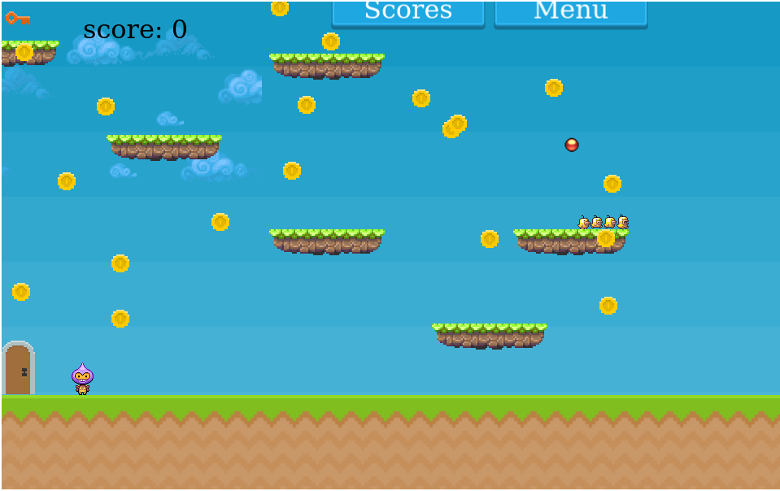

<h1 align="center">Welcome to Quest for treasure 👋</h1>
<br>

This project is part of a series of projects to be completed by students of [Microverse](https://www.microverse.org/).

Quest for treasure is created using vanilla JS and Phaser Js. It is a simple Video game. It is a platform game where the goal of the game is to fetch the key and open the door that leads to the next level.
<br>
<p>
  
  <br>
  <a href="https://quest-for-treasure.netlify.com/" target="_blank">
    
  </a>
</p>

<br>

The full project requirements can be found [here](https://www.notion.so/RPG-game-f94a617841e240a293c0b6928beebe89).

The full description of the game can be found [here](https://github.com/damiecode/Quest-for-treasure/wiki)

## Game Design Document

### The Game overview

**_This game focuses on the desire for humans to get what they want. The player has to play to get the treasure while trying to avoid all obstacles._** [read more here](Quest-for-treasure.md)

[Click here for game design document in PDF](./docs/QUEST%20FOR%20TREASURE.pdf)

## HOW TO PLAY

This is a simple prototype of a game where the player has to get a key to open the door to the next level of a game while avoiding obstacles like the bomb and the spider.Use the arrows of your keyboard to control the player to jumping and moving left and right.

## DESIGN PROCESS

This is how this game was designed: In the first two days, what I had in mind was a game that was both interesting and challenging for the users. I planned that the game will have at least 2 levels since I could not get all my idea in one level. I named it quest for treasure where the treaure was the key which will take the player to the next level which would be more difficult than the next. I used the avialble sprites for the game and wanted all different scenes of the game to be in different files so it would be easier for me to spot errors when something goes wrong. Since i had some obstacles for the player to loose I had to create a way whch the user could gain points so I added coins to the game.

## Built With

- JavaScript (ES6)
- HMTL
- PHASER JS
- npm
- webpack

### ✨ [Live Demo](https://quest-for-treasure.netlify.com/)

## Usage

> Clone the repository to your local machine

```sh
$ git clone https://github.com/damiecode/Quest-for-treasure.git
```

> cd into the directory, install dependencies, build and start

```sh
$ cd 
QUEST-FOR-TREASURE
$ npm install
$ npm run build
$ npm run start
```

> Open `http://127.0.0.1:8080` using your favourite broswer, if it doesn't open automatically.

## Authors

👤 **Damilola Ale**

- Github: [@damiecode](https://github.com/damiecode)
- Twitter: [@iamlildamski](https://twitter.com/iamlildamski)

## 🤝 Contributing

Contributions, issues and feature requests are welcome!<br />Feel free to check [issues page](https://github.com/damiecode/Quest-for-treasure/issues).

1. Fork it (https://github.com/damiecode/Quest-for-treasure/fork)
2. Create your working branch (git checkout -b [choose-a-name])
3. Commit your changes (git commit -am 'what this commit will fix/add/improve')
4. Push to the branch (git push origin [chosen-name])
5. Create a new Pull Request

## Future features
- Create different and more interesting levels for the game
- Load the game levels with JSOn file
- Modularize code so levels can be loaded in one page.

## Show your support

Give a ⭐️ if you like this project!

## Contact me

I am looking for my next opportunity. Reach out to me if you are looking to hire!
_codenlyn@gmail.com_
